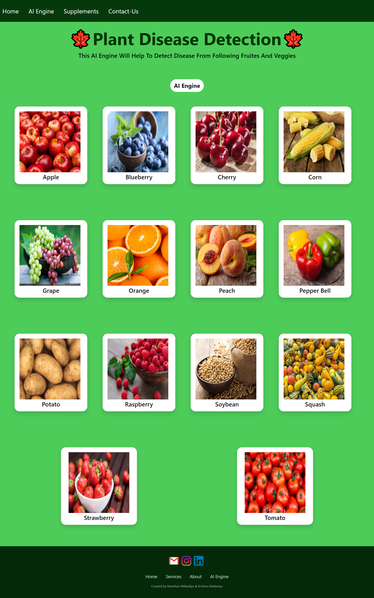
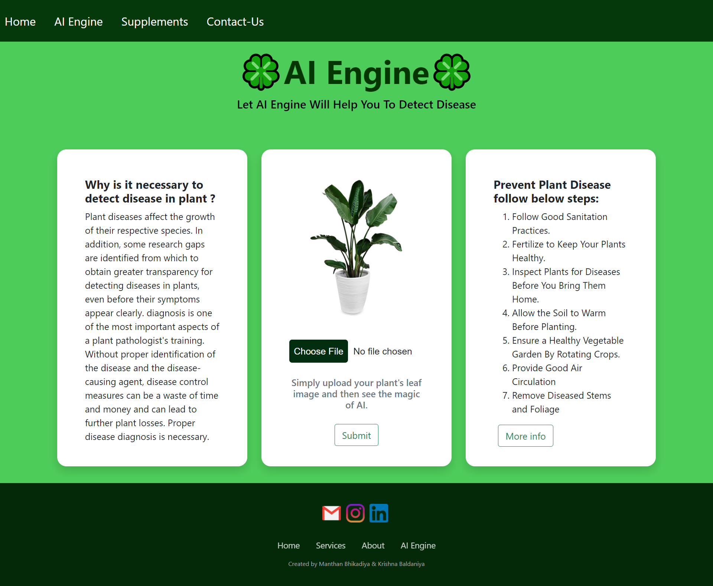
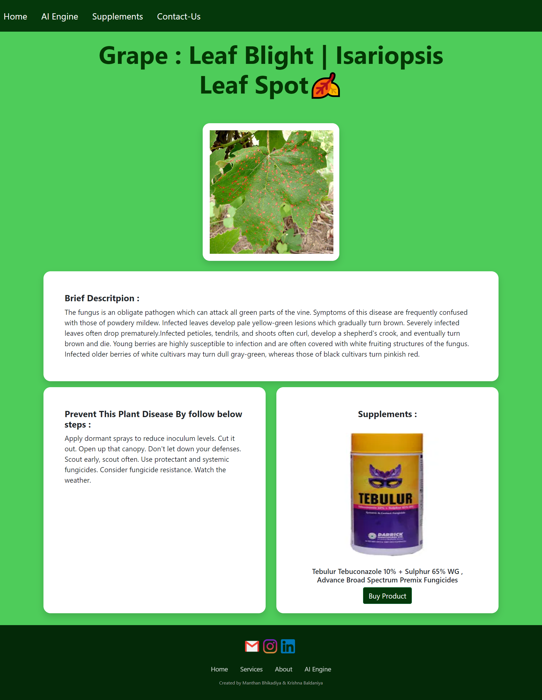

# ⭐Plant-Disease-Detection
* Plant Disease is necessary for every farmer so we are created Plant disease detection using Deep learning. In which we are using convolutional Neural Network for classifying Leaf images into 39 Different Categories. The Convolutional Neural Code build in Pytorch Framework. For Training we are using Plant village dataset.

* The pre-trained model file `plant_disease_model_1.pt` from [here](https://drive.google.com/drive/folders/1ewJWAiduGuld_9oGSrTuLumg9y62qS6A?usp=share_link)

## ⭐Snippet of Web App :
#### Main page
  
#### AI Engine 
  
#### Results Page 
  
#### Supplements/Fertilizer  Store
  

## My Contributions
- Designed and implemented the deep learning architecture, selecting the optimal CNN model to achieve high accuracy in diagnosing leaf diseases.
- Preprocessed and augmented the dataset to improve model generalizability and reduce training time by 15%.
- Conducted comprehensive data analysis and model performance evaluations, achieving an accuracy improvement of over 90%.
- Authored detailed project documentation for reproducibility and future scalability.
- Managed the overall workflow, from model selection to final analysis and deployment, ensuring project success.

